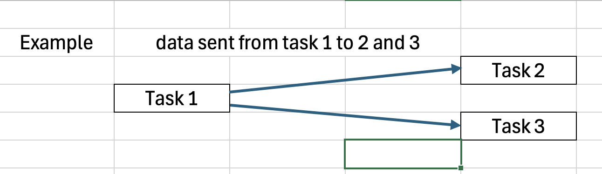
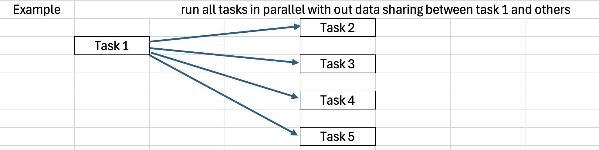

# dependencies-in-prefect


## Sending data from one task to the other

Relevant docs found [here](https://docs.prefect.io/latest/guides/specifying-upstream-dependencies/#determination-methods).

[passing_data_simple.py](example_scripts/passing_data_simple.py)
```python
@flow
def my_flow():
    x = task_1.submit()
    y = task_2.submit(x)
    z = task_3.submit(x)
    return y, z
```


## Dependencies without sharing data between tasks



You can use [wait_for](https://docs.prefect.io/latest/guides/specifying-upstream-dependencies/?h=wait_for#manual) syntax.

[wait_for_simple.py](example_scripts/wait_for_simple.py)
```python
@flow
def my_flow():
    a = task_1.submit()
    b = task_2.submit(wait_for=[a])
```


## Group tasks using subflows
Relevant docs found [here](https://docs.prefect.io/latest/concepts/flows/?h=subflows#composing-flows).

[subflows.py](example_scripts/subflows.py)

```python
@task
def task_a():
    return 1


@task
def task_b(x):
    return x + 2


@flow(name="Subflow")
def my_subflow(msg):
    print(f"Subflow says: {msg}")
    x = task_a.submit()
    y = task_b.submit(x)


@flow(name="Hello Flow")
def hello_world(name="world"):
    message = print_hello.submit(name)
    my_subflow(message)
```


## Dynamic tasks

[dynamic_tasks.py](example_scripts/dynamic_tasks.py)
```python
from prefect import flow, task


@task
def task1(num):
    print(f"Task {num}")


@flow
def flow_of_sequential_tasks():
    nums = [1, 2, 3]

    fut = None
    for num in nums:
        fut = task1.submit(num, wait_for=[fut] if fut is not None else [])


if __name__ == "__main__":
    flow_of_sequential_tasks()
```